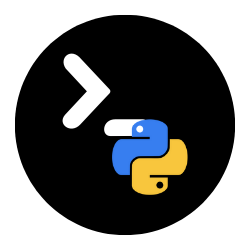

<div align="center">
  
  <h1>PyNotebook</h1>
  <p><strong>Serverless Python in your Browser</strong></p>

  <p>
    
    
    
    
    
  </p>
</div>

---

**PyNotebook** is a lightweight, single-file Jupyter-like notebook environment that runs Python code entirely in your web browser using [Pyodide](https://pyodide.org/).

Unlike traditional notebooks that require a backend server, PyNotebook executes code on your device via WebAssembly. This makes it **private**, **fast**, and **offline-capable**.

## 🚀 Why PyNotebook?

| Feature | PyNotebook | Google Colab |
| :--- | :--- | :--- |
| **Privacy** | 🔒 **High** (Code stays on device) | ☁️ **Low** (Uploaded to Google) |
| **Offline Use** | ✅ **Yes** (Works without internet) | ❌ **No** (Constant connection required) |
| **Mobile Experience** | 📱 **Native-like** (PWA optimized) | 💻 **Desktop-first** (Hard to use on mobile) |
| **Latency** | ⚡ **Instant** (Zero network lag) | 🐢 **Variable** (Depends on connection) |
| **Timeouts** | ♾️ **None** (Run as long as you want) | ⏱️ **Strict** (Disconnects when idle) |
| **Turtle Graphics** | 🐢 **Native** (Smooth, built-in) | 🚧 **Difficult** (Requires hacks/plugins) |
| **DataFrames** | 📊 **Interactive HTML** (Styled tables) | 📄 **Basic** (Standard output) |

## ✨ Key Features

*   **Client-Side Execution**: Powered by WebAssembly. Your data is yours.
*   **Rich Library Support**: Pre-loaded with `numpy`, `pandas`, and `matplotlib`.
*   **Turtle Graphics**: 🐢 Native support for Python Turtle graphics—perfect for education!
*   **Mobile PWA**: Installable as an app on iOS and Android.
*   **Persistent Storage**:
    *   **Auto-Save**: Never lose your work.
    *   **Cloud Sync**: Sign in with Google/Email to sync across devices.
    *   **Local Mode**: Guest mode uses LocalStorage.
*   **Smart Input**: Non-blocking `input()` calls allow for interactive scripts.
*   **Beautiful UI**:
    *   Dark/Light Mode with vibrant syntax highlighting.
    *   Collapsible Code & Output cells.
    *   Rich output rendering (DataFrames, Plots, HTML).

## 🛠️ Usage

### Local Development
Since Pyodide requires CORS compliance for loading packages, you cannot run this file directly via `file://` protocol.

1.  **Clone the repository:**
    ```bash
    git clone https://github.com/your-username/pynotebook.git
    cd pynotebook
    ```

2.  **Start a local server:**
    ```bash
    python -m http.server 8000
    ```

3.  **Open in Browser:**
    Go to `http://localhost:8000`

### Deployment
PyNotebook is a static web app. You can deploy `index.html` and the `assets` folder to any static host:
*   GitHub Pages
*   Vercel
*   Netlify
*   Firebase Hosting

## 📦 Dependencies
This project uses the following libraries via CDN (no build step required):
*   **React 18** (UI Framework)
*   **Tailwind CSS** (Styling)
*   **Pyodide** (Python Runtime)
*   **CodeMirror 5** (Editor)
*   **FontAwesome** (Icons)

## 📄 License
MIT License. Free for personal and educational use.
